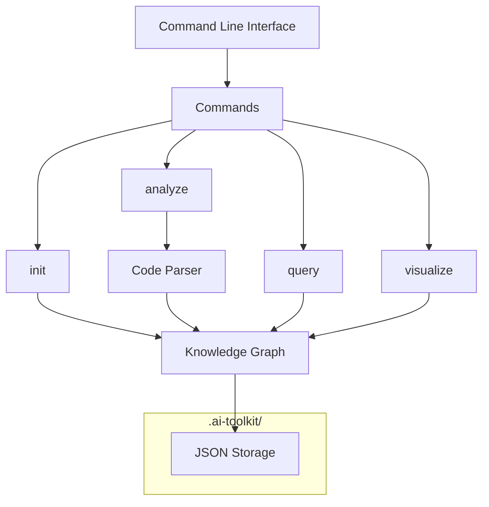

# AI-Native Development Toolkit Architecture

## System Overview

The AI-Native Development Toolkit is designed as a command-line application with a focused set of tools to help AI agents understand and work with codebases. The architecture prioritizes simplicity, command-line accessibility, and a clear .ai-toolkit/ directory structure.



## Core Components

### Command Line Interface (cli)

The primary interface for AI agents to interact with the toolkit.

**Key Files:**
- `cli/main.py`: Entry point and command dispatcher
- `cli/commands/init.py`: Project initialization
- `cli/commands/analyze.py`: Code analysis command
- `cli/commands/query.py`: Knowledge graph queries
- `cli/commands/visualize.py`: Visualization generation

**Example Commands:**
```bash
ai-toolkit init
ai-toolkit analyze --directory src/
ai-toolkit query --component UserService --relationships
ai-toolkit visualize --format mermaid --output system.md
```

### Knowledge Graph Engine (kb)

A simplified graph database for storing component and relationship information.

**Key Files:**
- `kb/graph.py`: Core knowledge graph implementation
- `kb/component.py`: Component data model
- `kb/relationship.py`: Relationship data model
- `kb/storage.py`: JSON-based persistence

**Key Classes:**
- `KnowledgeGraph`: Main container for components and relationships
- `Component`: Represents code entities (modules, classes, functions)
- `Relationship`: Connects components (dependencies, calls)
- `JSONStorage`: Handles persistence to JSON files

### Code Parser (parser)

Tools for analyzing Python code and extracting structural information.

**Key Files:**
- `parser/python.py`: Python code analyzer
- `parser/extractor.py`: Component extraction logic
- `parser/dependency.py`: Dependency detection

**Key Classes:**
- `PythonParser`: Parses Python files using AST
- `ComponentExtractor`: Identifies components in code
- `DependencyDetector`: Finds relationships between components

### Visualization Generator (viz)

Creates human-readable diagrams from the knowledge graph.

**Key Files:**
- `viz/mermaid.py`: Mermaid diagram generator
- `viz/formats.py`: Output format handlers

**Key Classes:**
- `MermaidGenerator`: Creates Mermaid markdown diagrams
- `DiagramGenerator`: Base class for visualization generators

## Data Models

### Component

```python
class Component:
    """Represents a code component (module, class, function)."""
    
    id: str           # Unique identifier
    name: str         # Human-readable name
    type: str         # Component type (module, class, function)
    file_path: str    # Source file location
    line_number: int  # Starting line number
    metadata: dict    # Additional properties
```

### Relationship

```python
class Relationship:
    """Represents a connection between components."""
    
    source_id: str    # ID of source component
    target_id: str    # ID of target component
    type: str         # Relationship type (imports, calls, inherits)
    metadata: dict    # Additional properties
```

### KnowledgeGraph

```python
class KnowledgeGraph:
    """Contains project components and relationships."""
    
    components: Dict[str, Component]  # Components by ID
    relationships: List[Relationship] # All relationships
    project_info: dict                # Project metadata
```

## Directory Structure

### Repository Structure

```
ai-toolkit/
├── src/
│   ├── ai_toolkit/          # Main package
│   │   ├── __init__.py
│   │   ├── cli/             # Command line interface
│   │   ├── kb/              # Knowledge graph
│   │   ├── parser/          # Code parsers
│   │   └── viz/             # Visualization
│   │
│   └── bin/
│       └── ai-toolkit       # Command-line entry point
│
├── tests/                   # Test suite
├── docs/                    # Documentation
├── scripts/
│   └── install.sh           # Installation script
└── pyproject.toml           # Package configuration
```

### Target Project Structure

```
user_project/
├── .ai-toolkit/             # Toolkit directory
│   ├── bin/                 # Command binaries
│   ├── kb/                  # Knowledge graph storage
│   │   ├── components.json
│   │   └── relationships.json
│   ├── config/              # Configuration
│   └── cache/               # Analysis cache
├── src/                     # User's source code
└── ...                      # Other project files
```

## Workflows

### Installation Workflow

1. User or AI assistant runs the installation script
2. Script downloads the toolkit package
3. Creates `.ai-toolkit/` directory in the current project
4. Extracts binaries and dependencies
5. Makes the `ai-toolkit` command available

### Analysis Workflow

1. AI assistant runs `ai-toolkit analyze --directory src/`
2. Parser scans Python files in the directory
3. Extracts components (modules, classes, functions)
4. Detects relationships between components
5. Updates the knowledge graph in `.ai-toolkit/kb/`

### Query Workflow

1. AI assistant runs a query command
2. System loads the knowledge graph from storage
3. Applies query filters and operations
4. Returns results in the specified format

### Visualization Workflow

1. AI assistant requests a visualization
2. System loads the knowledge graph
3. Visualization generator creates a diagram
4. Outputs to the specified format (Mermaid markdown, etc.)

## Design Decisions

### 1. Command-line First

All functionality is exposed through CLI commands to make it easy for AI assistants to invoke via shell commands. This avoids requiring complex Python import/API knowledge.

### 2. Simple Storage Format

Using JSON files for storage rather than databases to:
- Eliminate dependencies
- Make it easy to inspect and debug
- Support version control of knowledge graph
- Simplify installation (no database setup)

### 3. Focused MVP Scope

Prioritizing four core commands (init, analyze, query, visualize) to deliver a useful MVP while keeping the system simple and maintainable.

### 4. Self-Contained Installation

The `.ai-toolkit/` directory contains everything needed, making it easy to add to any project without affecting the main project structure.

### 5. Python-First Analysis

Initially focusing only on Python code analysis to deliver value quickly, with a clean extension path for other languages.

## Extension Points

The system is designed to be extended in the following ways:

1. **Additional Commands**: New CLI commands can be added to the command registry
2. **Language Parsers**: Support for other programming languages beyond Python
3. **Visualization Formats**: Additional diagram types and output formats
4. **Query Capabilities**: Enhanced query operations and filters
5. **Storage Backends**: Alternative storage mechanisms beyond JSON

## Technical Constraints

1. **Python Compatibility**: Compatible with Python 3.9+
2. **Minimal Dependencies**: Core functionality uses standard library where possible
3. **Performance Considerations**: Optimized for projects up to ~50K LOC
4. **No Code Modification**: Analysis only, no automatic code changes in MVP
