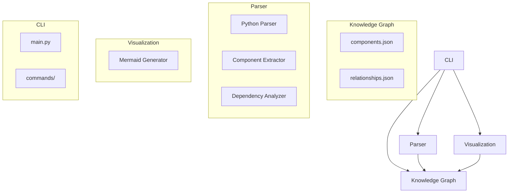

# AI-Toolkit Self-Analysis

This is a demonstration of the AI-Native Development Toolkit analyzing itself. 

The toolkit's key components include:

- **Knowledge Graph (kb/)**: Stores the component and relationship data
- **Parser (parser/)**: Analyzes code to extract components and relationships
- **CLI (cli/)**: Provides the command-line interface
- **Visualization (viz/)**: Generates diagrams from the knowledge graph

## Conceptual Architecture

While the current implementation is a prototype with placeholder functionality, this diagram illustrates the conceptual architecture of the toolkit.

## Next Steps for Development

1. Implement full Python parser functionality in `parser/python.py`
2. Enhance the knowledge graph storage in `kb/storage.py`
3. Add more visualization formats in `viz/formats/`
4. Expand query capabilities in `cli/commands/query.py` 